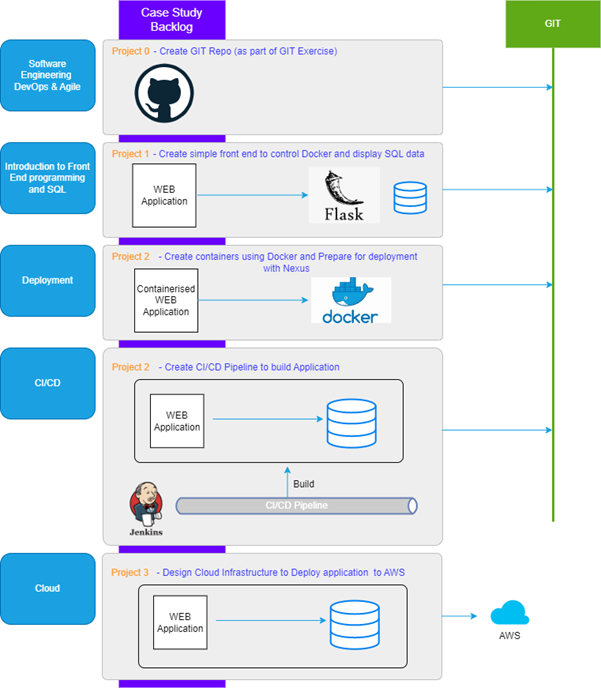
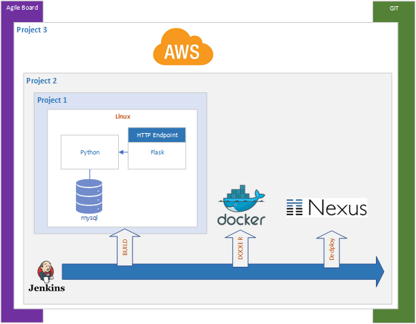

# FCA - DevOps Program

<!-- TOC -->
* [FCA - DevOps Program](#fca---devops-program)
  * [Introduction](#introduction)
  * [Case Study - Remote Backup Automation](#case-study---remote-backup-automation)
    * [FEATURE: RUN BACKUP](#feature-run-backup)
    * [FEATURE: DISPLAY LOGS](#feature-display-logs)
    * [FEATURE: DISPLAY STATISTICS](#feature-display-statistics)
  * [Minimal Viable Product](#minimal-viable-product)
<!-- TOC -->

**Reference Implementations (Model Answers)**
- [Project 1 - Python/MYSQL/Flask](project1-python-flask/README.md)
- [Project 2 - CI/CD, DOCKER, Nexus](project2-jenkins-docker/README.md)
- [Project 3 - Deploy to AWS](project3-aws/README.md)

---

## Introduction
The program revolves around a case study of developing application for automating files backups that will be deployed to AWS.  The program consists of three dedicated project lab stages that mimic a DevOps life cycle from Application Development, CI/CD and Deploying to the Cloud.

<figcaption><b>Fig.1 - Project Plan</b></figcaption>

---

**Project 0**
This is equivalent of the set-up sprint and will be part of the GIT exercises by setting up a GIT repository that will be used by rest of the projects for source and version management.

**Project 1**
Project 1 involves building an automation process for archive files that can be controlled by REST API using Flask, Python and MYSQL that can be invoked from a remote machine.

**Project 2**
This consist of building and dockerising the Python application from project 1

**Project 3**
Design AWS infrastructure for the deployment of Project 1 Python Application to AWS that can  access from the WEB. 

The following diagram how the projects relate to each other. 

<figcaption><b>Fig.2 - Projects Overview</b></figcaption>

---

## Case Study - Remote Backup Automation
The project will be based on the creation of a manual backup auditing and reporting system with the following features:

### FEATURE: RUN BACKUP
>**Scenario: Required Folder Exists**  
Given the specified folder exists  
Given the flask automation application is up and running  
When the backup/{folder_name} command is sent to the relevant flask http endpoint  
Then the folder is copied into the user backup folder on the remote machine  
And an ‘Action: Backup’ record with a status of “SUCCESS” is stored in the DB  

>**Scenario: Required Folder does not Exist**  
Given the specified folder does not exist  
When backup for the specified folder command is invoked  
Then an error status is returned with an “No such directory” error message  
And an ‘Action: Backup’ record with a status of “FAILED” is stored in the DB  

### FEATURE: DISPLAY LOGS
>**Scenario: user request logs with no criteria**  
When {get_logs} command is invoked with no creteria  
Then all the logs is returned  
And an ‘Action: Get Log’ record with a status of “SUCCESS” is stored in the DB  

>**Scenario: user request logs for a date range**  
Given that a valid date range has been specified  
When {get_logs} command is invoked  
Then all the records within the date range (inclusive start and end date) is returned  
And an ‘Action: Get Log’ record with a status of “SUCCESS” is stored in the DB  

### FEATURE: DISPLAY STATISTICS
>**Scenario:User requests stats**  
When {get_stats} command is invoked  
Then the total number of backups, successes and failures are returned  
And an ‘Action: Get State’ record with a status of “SUCCESS” is stored in the DB  

---

## Minimal Viable Product
- **Remote backup**
  - Able to invoke remote backup from CURL

- **Display Logs**
  - ABle to display all logs

- **CI/CD**
  - Pipeline to build, dockerise project 1 and push Nexus Repository

- **Cloud/AWS**
  - Able to deploy project 1 as docker and  a local mysql (can be docker)
  - Single VM on public subnet
  - Be able to invoke remote backup over the internet