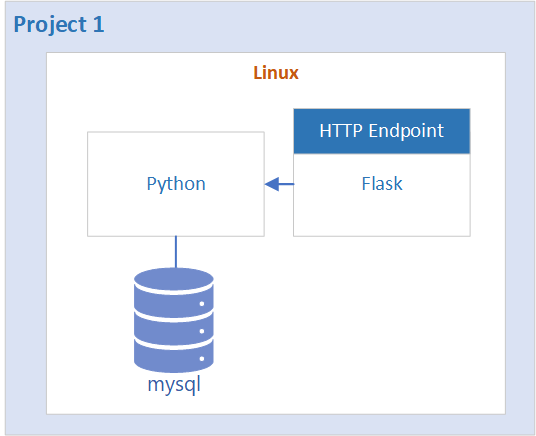
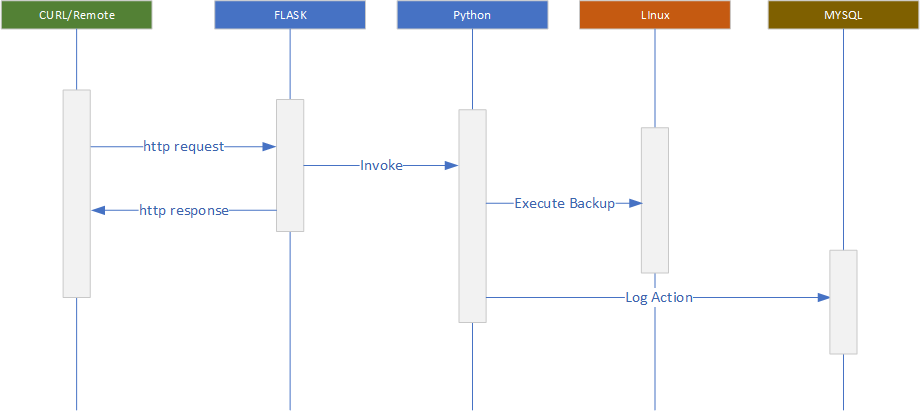
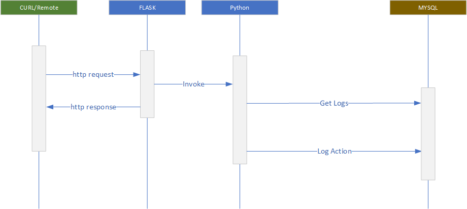

**&larr; [Back to Program README](../README.md)**
# Project 1 : Python, Flask, MySQL

<!-- TOC -->
- [Project 1 : Python, Flask, MySQL](#project-1--python-flask-mysql)
  - [Introduction](#introduction)
  - [API Design](#api-design)
  - [Tasks](#tasks)
  - [Reference Solution](#reference-solution)
    - [Dependancies](#dependancies)
      - [Specifying the Backup Folder location](#specifying-the-backup-folder-location)
    - [Database](#database)
  - [Minimal Viable Product](#minimal-viable-product)
<!-- TOC -->

## Introduction
Project 1 consists of building a Remote backup automation that can be invoked remotely using http.  The high level architecture is shown in figure 1 below.  While this use case does not necessary reflect a real preactical case, it does server to demonstrate how automation can be invoked and controlled via a WEB (REST) API.


<figcaption><b>Fig.1 - Project 1</b></figcaption>

A single table for recording logs is describe in figure 2 below:


| Field     | Type          | Null | Key | Default           |                   | Comment                                    |
|-----------|---------------|------|-----|-------------------|-------------------|--------------------------------------------|
| id        | int           | NO   | PRI | NULL              | auto_increment    | Primary KEY                                |
| date      | timestamp     | NO   |     | CURRENT_TIMESTAMP | DEFAULT_GENERATED | Datetime                                   |
| action    | varchar(100)  | YES  |     | NULL              |                   | The action performed (Backup, Stats, Logs) |
| parameter | varchar(1000) | YES  |     | NULL              |                   |                                            |
| status    | varchar(100)  | YES  |     | NULL              |                   | SUCCESS or ERROR                           |


## API Design
See [API Design](./docs/api.md)

## Tasks

The following lists the technical tasks required for Project 1.

>**Technical Tasks**
> Install docker  
> Install mysql as docker image  
> Create SQL schema

The following features is applicable to project 1 as outlined [program README](../README md/#case-study---remote-backup-automation)

This feature requires taking a command form a FLASK endpoint and executing the necessary logic in Python.
Each action will be recorded in the DB. 

- [RUN BACKUP](../README.md/#feature-run-backup)

  
<figcaption><b>Fig.3 - Backup Sequence</b></figcaption>

- [DISPLAY LOGS](../README.md/#feature-display-logs)
- [DISPLAY STATISTICS](../README.md/#feature-display-statistics)

These two features involves reading the actions table and returning the relevant result.  There is no logic to be performed with the Linux system 

  
<figcaption><b>Fig.3 - Stats and Logs Sequence</b></figcaption>  
  
    
## Reference Solution

### Dependencies

The reference code has the following dependancies

```bash
pip install python-dateutil
pip install Flask
pip install mysql-connector-python
```

#### Specifying the Backup Folder location

The reference answer will use the path specified in the environment variable ```BACKUPFOLDER``` to store all its backup.  If the BACKUP-FOLDER env varible is not defined, the code default to storing all backups in a local folder (backup).  See backup.py


```bash
# Linux
export BACKUPFOLDER=[path]

where [pathj] = path to the backup folder e.g. ./somefolder
```

```shell
# Windnows Shell
SET BACKUPFOLDER=[path]

where [pathj] = path to the backup folder e.g. C:
```

### Running the code
```bash
python app.py

# Using Curl

# Backup example
curl -X POST http://localhost:5000 -H "Content-Type: application/json" -d '{"path":"G:\hello"}' 

# Get Log
curl localhost:5000/log?start=2023-06-01&end=2023-08-31

# Get Log
curl localhost:5000/stat
```

### Database

The following shows the scripts for create the Reference Solution Database

**Creating the project database**
```sql
CREATE DATABASE fca;
```
**Creating the log table**

```SQL
CREATE TABLE log(
  id        INT PRIMARY KEY AUTO_INCREMENT,
  date      TIMESTAMP NOT NULL DEFAULT CURRENT_TIMESTAMP,
  action    VARCHAR(100),
  parameter VARCHAR(1000),
  status    VARCHAR(100)
);
```

## Minimal Viable Product
- **Remote backup**
  - Able to invoke remote backup from CURL

- **Display Logs**
  - Able to display all logs
