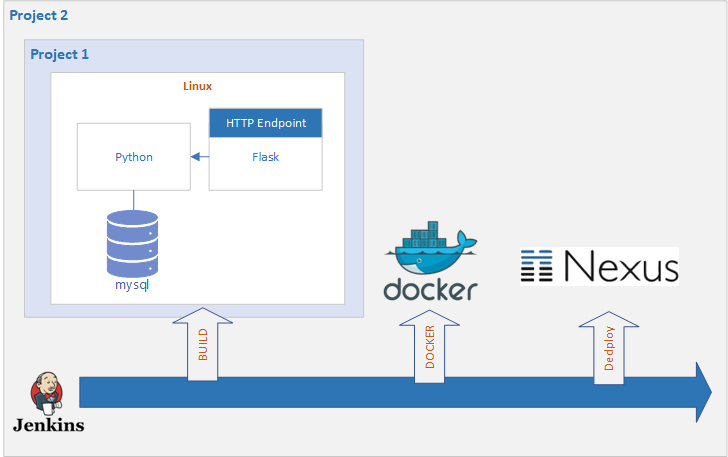

**&larr; [Back to Program README](../README.md)**
# Project 2 Jenkins (CI/CD), Docker, NEXUS 

  * [Introduction](#introduction)
  * [Reference Solution](#reference-solution)
---
## Introduction
The purpose of this document is to outline the project 2
specification that you will be working on during the training. It will
be treated as **the** document that outlines your project and sets the
expectations. 

  
<figcaption><b>Fig.1 - CICD</b></figcaption>

This project will involve concepts from all core training modules; more
specifically, this will involve:
* Project Management
* Python Fundamentals
* Python Web Development 
* Git
* SQL Databases
* Jenkins Pipeline Orchestration
* Docker Containerisation
* Nexus Repositories

This is an **individual** project and utilises the code created during project 1.

## Objective

To create a fully automated CI pipeline, based around the program created during project 1.
The two aspects of this project are to set up an initial automated pipeline and to be able to push changes through the pipeline. 

## Scope
The requirements set for the project are below. Note that these are a
minimum set of requirements that you can add to during the project.

The requirements of the project are as follows:

*  To use a Trello board (or equivalent Kanban board tech) with full expansion
on user stories, use cases and tasks needed to complete the project.
It could also provide a record of any issues or risks that you faced
creating your project.
*  To use an inline relational database used to store data persistently for the
project.
*  To provide clear Documentation from a design phase describing the architecture
you will use for you project as well as a detailed Risk Assessment.
*  To deploy a containerised image of project 1's application stored in a nexus repository.
   A functioning API, using Flask.
*  For code to be fully integrated into a Version Control System using the
Feature-Branch model which will subsequently be built through a CI
server and deployed to a cloud-based virtual machine.

You should consider the concept of MVP (Minimum Viable Product) as you
plan your project, completing all the requirements above before you add
extra functionality that is not specified above.

## Tasks

### Configure Nexus

* Configure Nexus for docker, you will need at least 1 private repository hosted in docker.

### Produce Application Image

* You will need to provision and set up a VM that can run your Jenkins Pipeline and also to host your Nexus Repository
* Ensure that the application from project 1 runs in a container on the VM
* You will use docker syntax to ensure that an image is generated that can be stored in the Nexus repo
* Be sure to demonstrate testing of your deployment to Nexus.

### Create Jenkins Pipeline for automation

* The previous tasks can be automated by Jenkins. Create a Jenkinsfile that will 
automate this process. Ensure that Jenkins is correctly connecting to the Nexus repository and has the correct permissions to use docker.

## Deliverables

The final deliverable for this project is a completed CI Pipeline with full documentation around the utilisation of supporting tools. Your documentation should also include evidence of design, risk assessment and testing.  
The CI Pipeline needs to be able to successfully deploy the application you have created as per the requirements. Your pipeline should support fully automatic deployment of code updates in real time, including pushing the latest image to the nexus repository.  
Your database should be an inline sqlite database in this case, successful connections to a database instance or sql container will not garner extra marks, though it would demonstrate a greater skillset.
